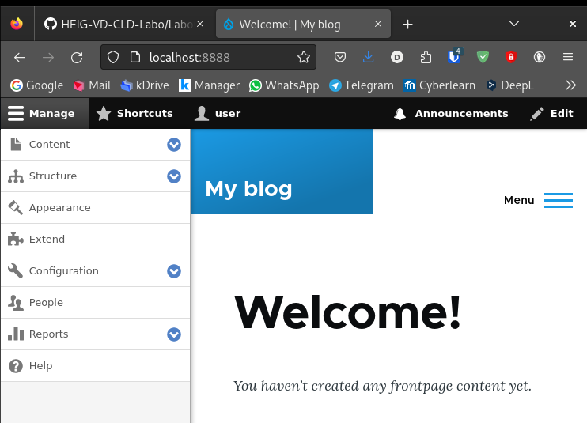

# Task 001 - Configure Auto Scaling


* Follow the instructions in the tutorial [Getting started with Amazon EC2 Auto Scaling](https://docs.aws.amazon.com/autoscaling/ec2/userguide/GettingStartedTutorial.html) to create a launch template.

* [CLI Documentation](https://docs.aws.amazon.com/cli/latest/reference/autoscaling/)

## Pre-requisites

* Networks (RTE-TABLE/SECURITY GROUP) set as at the end of the Labo2.
* 1 AMI of your Drupal instance
* 0 existing ec2 (even is in a stopped state)
* 1 RDS Database instance - started
* 1 Elastic Load Balancer - started

```bash
# create loadbalancer
[INPUT]
aws elbv2 create-load-balancer \
--name ELB-${GROUP_NAME} \
--scheme internal \
--ip-address-type ipv4 \
--subnets $SUBNET_A_ID $SUBNET_B_ID \
--security-groups $SECURITY_GROUP_LD_ID\
--profile $PROFILE

[Output]
{
    "LoadBalancers": [
        {
            "LoadBalancerArn": "arn:aws:elasticloadbalancing:eu-west-3:709024702237:loadbalancer/app/ELB-DEVOPSTEAM05/48373553eb99f53e",
            "DNSName": "internal-ELB-DEVOPSTEAM05-599445391.eu-west-3.elb.amazonaws.com",
            "CanonicalHostedZoneId": "Z3Q77PNBQS71R4",
            "CreatedTime": "2024-04-11T14:04:39.720000+00:00",
            "LoadBalancerName": "ELB-DEVOPSTEAM05",
            "Scheme": "internal",
            "VpcId": "vpc-03d46c285a2af77ba",
            "State": {
                "Code": "provisioning"
            },
            "Type": "application",
            "AvailabilityZones": [
                {
                    "ZoneName": "eu-west-3a",
                    "SubnetId": "subnet-0ae144aabdbd0ca14",
                    "LoadBalancerAddresses": []
                },
                {
                    "ZoneName": "eu-west-3b",
                    "SubnetId": "subnet-0fe3940f8eec03cf3",
                    "LoadBalancerAddresses": []
                }
            ],
            "SecurityGroups": [
                "sg-0fdbe692da3bc47eb"
            ],
            "IpAddressType": "ipv4"
        }
    ]
}
```

```bash
#
[INPUT]
aws elbv2 create-listener \
    --load-balancer-arn $LOADBALANCER_ARN \
    --protocol HTTP \
    --port 8080 \
    --default-actions Type=forward,TargetGroupArn=$TARGETGROUP_ARN \
    --profile $PROFILE

[OUTPUT]
{
    "Listeners": [
        {
            "ListenerArn": "arn:aws:elasticloadbalancing:eu-west-3:709024702237:listener/app/ELB-DEVOPSTEAM05/48373553eb99f53e/fd60ccd33556191a",
            "LoadBalancerArn": "arn:aws:elasticloadbalancing:eu-west-3:709024702237:loadbalancer/app/ELB-DEVOPSTEAM05/48373553eb99f53e",
            "Port": 8080,
            "Protocol": "HTTP",
            "DefaultActions": [
                {
                    "Type": "forward",
                    "TargetGroupArn": "arn:aws:elasticloadbalancing:eu-west-3:709024702237:targetgroup/TG-DEVOPSTEAM05/90c93af8c3baa5b3",
                    "ForwardConfig": {
                        "TargetGroups": [
                            {
                                "TargetGroupArn": "arn:aws:elasticloadbalancing:eu-west-3:709024702237:targetgroup/TG-DEVOPSTEAM05/90c93af8c3baa5b3",
                                "Weight": 1
                            }
                        ],
                        "TargetGroupStickinessConfig": {
                            "Enabled": false
                        }
                    }
                }
            ]
        }
    ]
}
```


## Create a new launch configuration. 

|Key|Value|
|:--|:--|
|Name|LT-DEVOPSTEAM[XX]|
|Version|v1.0.0|
|Tag|Name->same as template's name|
|AMI|Your Drupal AMI|
|Instance type|t3.micro (as usual)|
|Subnet|Your subnet A|
|Security groups|Your Drupal Security Group|
|IP Address assignation|Do not assign|
|Storage|Only 10 Go Storage (based on your AMI)|
|Advanced Details/EC2 Detailed Cloud Watch|enable|
|Purchase option/Request Spot instance|disable|

```bash
[INPUT]
#cli command
aws autoscaling create-launch-configuration \
    --launch-configuration-name LT-${GROUP_NAME} \
    --image-id $IMAGE_ID_DRUPAL_LABO_2 \
    --instance-type $INSTANCE_TYPE \
    --security-groups ${SECURITY_GROUP_DMZ_ID} \
    --no-associate-public-ip-address \
    --profile $PROFILE
    
[OUTPUT]
{
    "LaunchConfigurationName": "LT-DEVOPSTEAM05",
    "LaunchConfigurationARN": "arn:aws:autoscaling:eu-west-3:709024702237:launchConfiguration:735db93b-78cc-497c-9381-dc005d3673ee:launchConfigurationName/LT-DEVOPSTEAM05",
    "ImageId": "ami-0b73a2deda2ac345f",
    "KeyName": "",
    "SecurityGroups": [
        "sg-0867c32d68bac6981"
    ],
    "ClassicLinkVPCSecurityGroups": [],
    "UserData": "",
    "InstanceType": "t3.micro",
    "KernelId": "",
    "RamdiskId": "",
    "BlockDeviceMappings": [],
    "InstanceMonitoring": {
        "Enabled": true
    },
    "CreatedTime": "2024-04-11T14:22:48.502000+00:00",
    "EbsOptimized": false,
    "AssociatePublicIpAddress": false
}

# finally done in the web console by creating a launch template
```

## Create an autoscaling group

* Choose launch template or configuration

|Specifications|Key|Value|
|:--|:--|:--|
|Launch Configuration|Name|ASGRP_DEVOPSTEAM[XX]|
||Launch configuration|Your launch configuration|
|Instance launch option|VPC|Refer to infra schema|
||AZ and subnet|AZs and subnets a + b|
|Advanced options|Attach to an existing LB|Your ELB|
||Target group|Your target group|
|Health check|Load balancing health check|Turn on|
||health check grace period|10 seconds|
|Additional settings|Group metrics collection within Cloud Watch|Enable|
||Health check grace period|10 seconds|
|Group size and scaling option|Desired capacity|1|
||Min desired capacity|1|
||Max desired capacity|4|
||Policies|Target tracking scaling policy|
||Target tracking scaling policy Name|TTP_DEVOPSTEAM[XX]|
||Metric type|Average CPU utilization|
||Target value|50|
||Instance warmup|30 seconds|
||Instance maintenance policy|None|
||Instance scale-in protection|None|
||Notification|None|
|Add tag to instance|Name|AUTO_EC2_PRIVATE_DRUPAL_DEVOPSTEAM[XX]|

```bash
[INPUT]
#cli command
aws autoscaling create-auto-scaling-group \
    --auto-scaling-group-name ASGRP_${GROUP_NAME} \
    --launch-configuration-name LT-${GROUP_NAME} \
    --vpc-zone-identifier $SUBNET_A_ID $SUBNET_B_ID \
    --availability-zones $ZONE_A_ID $ZONE_B_ID \
    --load-balancer-names ELB-${GROUP_NAME} \
    --health-check-type ELB \
    --health-check-grace-period 10 \
    --target-group-arns $TARGETGROUP_ARN \
    --desired-capacity 1 \
    --min-size 1 \
    --max-size 4 \
    --vpc-zone-identifier "subnet-5ea0c127,subnet-6194ea3b,subnet-c934b782"


[OUTPUT]
# done in the web console
```

* Result expected

The first instance is launched automatically.

Test ssh and web access.

```
[INPUT]
//ssh login
ssh devopsteam05@15.188.43.46 -i ~/.ssh/CLD_KEY_DMZ_DEVOPSTEAM05.pem -L 2223:10.0.5.9:22
ssh devopsteam05@15.188.43.46 -i ~/.ssh/CLD_KEY_DMZ_DEVOPSTEAM05.pem -L 8888:10.0.5.9:8080
ssh bitnami@localhost -p 2223 -i ~/.ssh/CLD_KEY_DRUPAL_DEVOPSTEAM05.pem
[OUTPUT]
```

```
//screen shot, web access (login)

```
