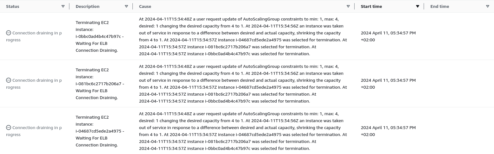

# Task 003 - Test and validate the elasticity


## Simulate heavy load to trigger a scaling action

* [Install the package "stress" on your Drupal instance](https://www.geeksforgeeks.org/linux-stress-command-with-examples/)

* [Install the package htop on your Drupal instance](https://www.geeksforgeeks.org/htop-command-in-linux-with-examples/)

* Check how many vCPU are available (with htop command)

```
[INPUT]
htop

[OUTPUT]
//copy the part representing vCPus, RAM and swap usage

    0[|||                                                                                                 2.0%]   Tasks: 31, 409 thr; 1 running
    1[                                                                                                    0.0%]   Load average: 0.00 0.02 0.00 
  Mem[||||||||||||||||||||||||||||||||||||||||||||||||||||||||||||||||||||||||||||||||||||||||||     248M/951M]   Uptime: 00:10:21
  Swp[|                                                                                             1.00M/635M]

```

### Stress your instance

```
[INPUT]
//stress command
stress -c 75

[OUTPUT]
//copy the part representing vCPus, RAM and swap usage
//tip : use two ssh sessions....

    0[||||||||||||||||||||||||||||||||||||||||||||||||||||||||||||||||||||||||||||||||||||||||||||||||||100.0%]   Tasks: 110, 409 thr; 2 running
    1[||||||||||||||||||||||||||||||||||||||||||||||||||||||||||||||||||||||||||||||||||||||||||||||||||100.0%]   Load average: 20.87 5.77 1.97 
  Mem[|||||||||||||||||||||||||||||||||||||||||||||||||||||||||||||||||||||||||||||||||||||||||||    260M/951M]   Uptime: 00:12:43
  Swp[|                                                                                             1.00M/635M]
```

* (Scale-IN) Observe the autoscaling effect on your infa


```
[INPUT]
//Screen shot from cloud watch metric
```

[Sample](./img/CLD_AWS_CLOUDWATCH_CPU_METRICS.PNG)

```
//TODO screenshot of ec2 instances list (running state)
```

[Sample](./img/CLD_AWS_EC2_LIST.PNG)

```
//TODO Validate that the various instances have been distributed between the two available az.
[INPUT]
//aws cli command

[OUTPUT]

```


```
//TODO screenshot of the activity history
```

[Sample](./img/CLD_AWS_ASG_ACTIVITY_HISTORY.PNG)

```
//TODO screenshot of the cloud watch alarm target tracking
```

[Sample](./img/CLD_AWS_CLOUDWATCH_ALARMHIGH_STATS.PNG)


* (Scale-OUT) As soon as all 4 instances have started, end stress on the main machine.

[Change the default cooldown period](https://docs.aws.amazon.com/autoscaling/ec2/userguide/ec2-auto-scaling-scaling-cooldowns.html)

```
//TODO screenshot from cloud watch metric
```


```
//TODO screenshot of ec2 instances list (terminated state)
```


```
//TODO screenshot of the activity history
```


## Release Cloud resources

Once you have completed this lab release the cloud resources to avoid
unnecessary charges:

* Terminate the EC2 instances.
    * Make sure the attached EBS volumes are deleted as well.
* Delete the Auto Scaling group.
* Delete the Elastic Load Balancer.
* Delete the RDS instance.

(this last part does not need to be documented in your report.)

## Delivery

Inform your teacher of the deliverable on the repository (link to the commit to retrieve)