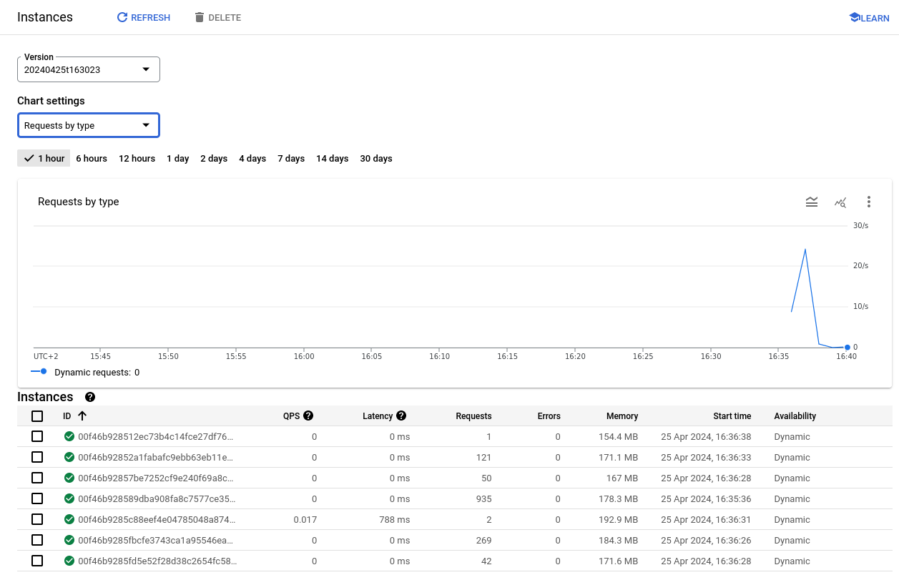
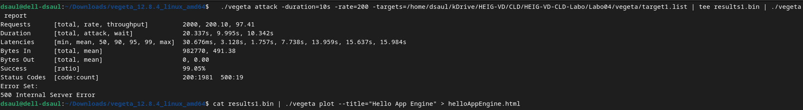

## Task 3: Test the performance of Datastore writes

In this task you will performance test the App Engine platform with a
load generator. You will compare the performance of normal request
processing and request processing that involves Datastore write
operations.

As the Servlets are deployed with Automatic Scaling, there is a danger
of consuming a lot of resources while testing, and burning through a
lot of money. Google gave you a coupon with some money that was put
into a billing account. Projects can have spending limits, but by
default it is unlimited. Before starting the performance test, you
have to set a reasonable daily spending limit.

Set a daily spending limit on the project as follows:

- In the Cloud Platform console navigate to **App Engine** >
  **Settings**. Click on **Edit**. Enter a daily spending limit of
  **$1.00**. (Note: Google has removed this functionality in January 2020. There is no replacement for it yet. Skip this
  step, but observe how many credits you have left before and after the performance tests. You can also limit the number
  of instances with an optional configuration of the autoscaling algorithm: In the file `appengine-web.xml` in
  the `<automatic-scaling>` element add a `<max-instances>` element with a small value (3, 4, ...).
  See <https://cloud.google.com/appengine/docs/standard/java/config/appref#scaling_elements>. An alternative is to use *
  *Budgets & alerts**. In the Cloud Platform console navigate to **Billing** > **Budgets & alerts**. Create a new budget
  for the month for an amount of **$1.00** and optionally set the actions associated with the alert.)

Conduct the performance tests as follows:

1. You should already have vegeta installed from previous labs. If not,
   see <https://blog.absyah.dev/super-simple-guide-for-load-testing-using-vegeta#heading-install-vegeta>.

2. First test the performance of normal request processing using the
   Servlet generated by the wizard.

    - Prepare an "attack" using vegeta.

    - In the App Engine console open the **Dashboard**.

    - Run the attack.

    - In the dashboard observe the graph of the incoming requests, the
      number of instances and the latency.

3. Test the performance of the Servlet that writes to the Datastore.

4. At the end of the tests observe in detail how much resources were
   used. In the console click on **Quota Details**.

5. If you are running out of resources because of the monthly spending
   limit, increase it carefully by a dollar or two.

Deliverables:

- For each performance test, write the command used to generate the attack with vegeta and copy the file generated by
  the vegeta plot command.

  ```
  //TODO command used
  ```

  ```
  ./vegeta attack -duration=10s -rate=200 -targets=/home/dsaul/kDrive/HEIG-VD/CLD/HEIG-VD-CLD-Labo/Labo04/vegeta/target1.list | tee results1.bin | ./vegeta report
  cat results1.bin | ./vegeta plot --title="Hello App Engine" > helloAppEngine.html
  ```
  
  
- 
- 
- 

  ```
  ./vegeta attack -duration=10s -rate=200 -targets=/home/dsaul/kDrive/HEIG-VD/CLD/HEIG-VD-CLD-Labo/Labo04/vegeta/target2.list | tee results2.bin | ./vegeta report
  cat results2.bin | ./vegeta plot --title="Datastore Write" > datastoreWrite.html
  ```
  
- 
- 
- 
- 

  ```
  //TODO copy/link file generated by vegeta plot command
  Labo04/vegeta/helloAppEngine.html
  Labo04/vegeta/datastoreWrite.html
  ```

- What response times do you observe for each Servlet?

  ```
  //TODO
  - Hello App Engine: Minimum is 30.676ms and maximum is 15.984s on vegeta and seems congruent to the Google Cloud Console
  - Datastore Write : Minimum is 53.616ms and maximum is 14.752s on both.
  
  It is also interesting to note that in general, responses from the Hello servlet are faster than the Datastore Write.
  We can see that 90% of responses coming from the Hello servlet are faster than the other ones.
  ```

- Compare the response times shown by vegeta with the App Engine
  console. Explain the difference.

  ```
  //TODO
  The response / latency times shown on the App Engine console report are higher than the response times in vegeta.
  The difference between the two is probably due to a different measurement. However we had expected that latency measured by vegata would be higher than the one measured on Google, since there is the Network inbetween.
  ```

- How many resources have you used to run these tests? From the
  **Quota Details** view of the console determine the non-zero resource
  quotas (**Daily quota** different from 0%). Explain each with a sentence.
  To get a sense of everything that is measured click on **Show resources not in use**.

  ```
  //TODO
  Let's preface this answer by defining what is Cloud Firestore first: It is a flexible, NoSQL cloud database built on Google
  Cloud Infrastructure.
  - Cloud Firestore Read Operations: Nmber of access to the database to read entries inside
  - Cloud Firestore API Calls: Number of time we use the dedicated API to interract with the database
  - Cloud Firestore Store Data : The total size of all entries inside the database
  - Data Sent to Cloud Firestore API : The total size of data send to the API
  - Data Received from Cloud Firestore API : The total size of the data received in the reponses from the API
  - Cloud Firestore Entity Fetch Ops: Number of read operations on Entities stored in the database
  - Cloud Firestore Entity Writes: Number of write operations on Entities stored to the database
  - Cloud Firestore Entity Delete: Number of delete operations on Entities from the database
  - Cloud Firestore Entity Index Write Ops: The number of time we create an index for an entry manually or automaticallly
  - Cloud Firestore Network Egress: Total size of network traffic coming from the database
  - Cloud Storage Network (Egress) - Americas and EMEA: Total size of network traffic coming from the storage 
  ```
  

- Let's suppose you become suspicious that the algorithm for the automatic scaling of
  instances is not working correctly. Imagine a way in which the algorithm could be broken. Which measures shown in the
  console would you use to detect this failure?

  ```
  //TODO
  The algorithm can have two problems: scaling up and scaling down unproperly.

  To check the former, we can use the following:
  - Checking latency measurement in the console: Servers overload when receiving a huge unexpected amount of requests. Consequently slowing down the response time and increasing latency.  
  - We can also actively test by stress testing our service and monitor the number of instances increases.
  
  To check the latter:
  - Keeping an eye on the amount of incoming requests and the number of instances: If we notice a consequent decrease of incoming request while the number of instances remain high and do not appear to decrease, we have to investigate why the algorithmn isn't terminating instances.
  - Stopping our previous stress test and check that the number of instances is reduced back to 1 or 0.
  ```

## Troubleshooting

If your Servlet that writes to the Datastore works OK on your local
machine, but you get a server error when running it in the Google
cloud, have a look at the logs (hamburger menu > Logs). If you see a
NoClassDefFoundError related to the Datastore you have run into a
[problem that was reported to Google on March 22, 2018](https://issuetracker.google.com/issues/76144204). The
problem is that the library for the Datastore,
`appengine-api-1.0-sdk`, is missing. Previously it was automatically
included by Google.

Here is a workaround:

- Create a new project (Google App Engine Standard Environment) that
  has Maven activated (option on the first screen of the wizard).
- Edit the file `pom.xml`: In the dependency declaration for
  `appengine-api-1.0-sdk` change the scope from `provided` to
  `compile` (this will include the dependency in the jar that is
  uploaded to Google).
- _Clean_ the project.
